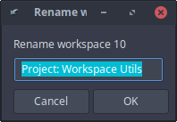

# rename-xfce-workspace

Rename the current Xfce workspace.

It takes no arguments, instead it opens a dialog box.



## Requirements

You need `wmctrl` & `zenity` installed. See: https://www.freedesktop.org/wiki/Software/wmctrl/ & 

For Xubuntu, you can do:

```shell
$ sudo apt install wmctrl zenity
```

## Installation

```shell
$ sudo cp rename-xfce-workspaces.sh /usr/bin/rename-xfce-workspaces
```

## Usage

`rename-xfce-workspaces`